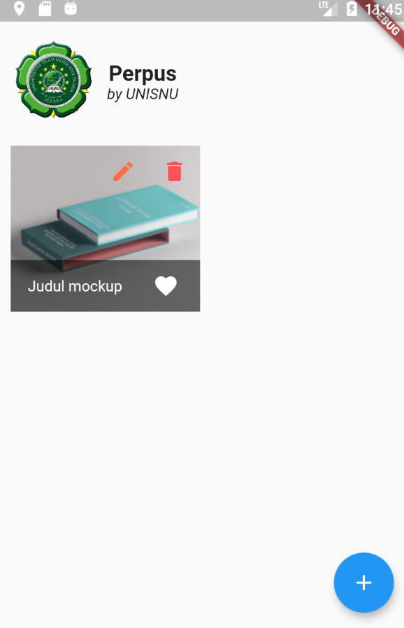
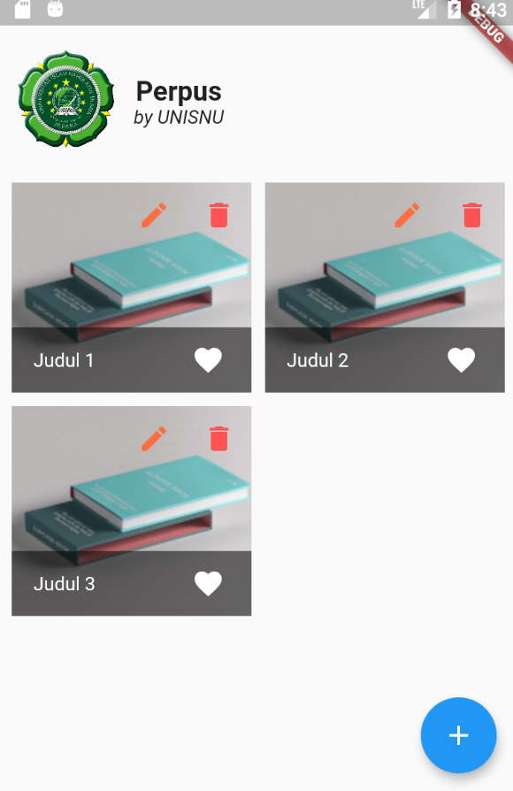

# Book list Mockup

Setelah selesai dengan setup **provider**. Saatnya kita mulai dengan *mockup* "Book list" /daftar buku kita.

## Siapkan `class` BookListItem

`class BookListItem`, saat ini masih dalam keadaat ter-*hardcode*. Artinya, judul, gambar dll kita tulis pada code dan akan selalu static(isinya sama).

### Variable dan constructor
Langkah awal, kita siapkan `class BookListItem` untuk siap menggunakan variable yang akan kita terima dari REST API nantinya.

Buka file `lib/widgets/home/book-list-item.dart`. Ubah sesuai baris yang ter-*highlight* berikut:

```dart linenums="1" hl_lines="4-11 13"
import 'package:flutter/material.dart';

class BookListItem extends StatelessWidget {
  @required
  final String apiHost;
  @required
  final String id;
  @required
  final String title;
  @required
  final String imagePath;

  BookListItem({this.apiHost, this.id, this.title, this.imagePath});
  
  @override
  Widget build(BuildContext context) {
  ...
```

Pada code diatas, kita membuat variable yang `@required` saat instanisasi pada Constructor. Artinya, class tersebut mensyaratkan variable-variable tersebut selalu disertakan.


### implementasi variable

Setelah pendeklarasian variable diatas, saatnya kita mengubah data-data yang saat ini ter-*hardcode*. Ubah sesuai baris yang ter-*highlight* berikut:

```dart linenums="14" hl_lines="5 6 29"
  ...
  @override
  Widget build(BuildContext context) {
    return GridTile(
      child: Image.network(
        "${this.apiHost}/perpus-api/${this.imagePath}",
        width: 80,
        height: 80,
        fit: BoxFit.cover,
      ),
      header: Row(
        mainAxisAlignment: MainAxisAlignment.end,
        children: [
          IconButton(
            splashColor: Colors.orange[100],
            color: Colors.deepOrangeAccent,
            icon: Icon(Icons.edit),
            onPressed: () {},
          ),
          IconButton(
            color: Colors.redAccent,
            icon: Icon(Icons.delete),
            onPressed: () {},
          ),
        ],
      ),
      footer: GridTileBar(
        backgroundColor: Colors.black54,
        title: Text(this.title),
        trailing: IconButton(
          splashColor: Colors.red[400],
          icon: Icon(Icons.favorite),
          onPressed: () {},
        ),
      ),
    );
  }
}
```

Perubahan:

- **Line 18**, kita rubah type `Image` yang sebelumnya `Image.asset` ( mengambil gambar dari local), menjadi `Image.network` ( mengambil gambar dari server HTTP)
- **Line 19**, kita membentuk URL HTTP gambar dengan variable.
- **Line 42**, kita gunakan variable untuk menampilkan tulisan judul buku.

## Dynamic Mockup

Jika sebelumnya kita Mockup dengan gambar dan text statis, kali ini kita akan mockup dengan text dan gambar dinamis dengan menggunakan variable dilanjutkan dengan provider.

### Variable mockup

Kita awali dengan mencoba menghardcode satu baris `BookListItem`

Buka file `lib/widgets/home/book-list.dart`, Ubah sesuai baris yang ter-*highlight* berikut:

```dart linenums="9" hl_lines="8-13"
...
class _BookListState extends State<BookList> {
  @override
  Widget build(BuildContext context) {
    return GridView.builder(
      padding: EdgeInsets.all(10),
      itemCount: 1,
      itemBuilder: (ctx, i) => BookListItem(
        id: "-",
        apiHost: "https://perpus-api.biqdev.com",
        imagePath: "assets/book.png",
        title: "Judul buku mockup",
      ),
      gridDelegate: SliverGridDelegateWithFixedCrossAxisCount(
        crossAxisCount: 2,
        childAspectRatio: 8 / 7,
        crossAxisSpacing: 10,
        mainAxisSpacing: 10,
      ),
...
```

Simpan dan jalankan aplikasi kita. Seharusnya tampilannya menjadi seperti ini:

{: style="width: 250px; height: auto;"}

Saat ini `BookListItem` sudah menggunakan variable untuk menampilkan data.

### Provider mockup

Setelah itu, kita mockup dengan data dari **provider**. Hal ini bertujuan untuk mensimulasikan data yang akan kita terima dari REST API nantinya sudah berada disisi **provider**.

1. Kita awali dengan me-*load* provider kita. Masih pada file `lib/widgets/home/book-list.dart`, ubah sesuai dengan baris yang ter-*hightlight* berikut:

    ```dart linenums="1" hl_lines="2 5-7 17-19"
    import 'package:flutter/material.dart';
    import 'package:provider/provider.dart';
    
    import 'package:perpus/widgets/home/book-list-item.dart';
    import 'package:perpus/models/booklist_model.dart';
    import 'package:perpus/providers/booklist_provider.dart';
    import 'package:perpus/providers/setting_provider.dart';
    
    class BookList extends StatefulWidget {
      @override
      _BookListState createState() => _BookListState();
    }
    
    class _BookListState extends State<BookList> {
      @override
      Widget build(BuildContext context) {
        var apiHost =
            Provider.of<SettingProvider>(context, listen: false).setting.apiHost;
        List<BookListModel> bookList = context.watch<BookListProvider>().list;
        
        return GridView.builder(
    ...
    ```
   
    1. Line ke-2, load library provider untuk mendapatkan fungsionalitas provider secara otomatis pada `context`
    1. Line ke-5 & 6, import model dan provider Book list kita
    1. Line ke-7, kita hanya mengimport provider untuk Setting, karena tidak ada deklarasi model yang rumit. Cukup mengambil string saja.
    1. Line ke-17 & 18, ambil variable setting `apiHost`
    1. Line ke-18, kita mengambil data **mockup** book list dari provider kita

1. Kita gunakan variabel `List<BookListModel> bookList` yang telah kita deklarasikan pada class `BookListItem` diatas. Masih pada file yang sama, ubah sesuai baris yang ter-*highlight* berikut:

      ```dart linenums="20" hl_lines="6-9"
          ...
          return GridView.builder(
            padding: EdgeInsets.all(10),
            itemCount: bookList.length,
            itemBuilder: (ctx, i) => BookListItem(
              id: bookList[i].id,
              apiHost: apiHost,
              imagePath: bookList[i].imagePath,
              title: bookList[i].title,
            ),
            gridDelegate: SliverGridDelegateWithFixedCrossAxisCount(
              crossAxisCount: 2,
              childAspectRatio: 8 / 7,
              crossAxisSpacing: 10,
              mainAxisSpacing: 10,
            ),
          );
        }
        ...
      ```
   
      Pada code diatas, kita gunakan variable `bookList` yang kita ambil dari **provider**. Karena variable `bookList` adalah bertype `List`, sehingga bisa kita akses dengan menggunakan index yaitu `i` yang di dapat dari `GridView.builder()`. Pada class `GridView.builder()`, secara otomatis akan melakukan *loop* sesuai angka `int` yang kita masukkan pada bagian `itemCount: bookList.length,`. Sehingga `itemBuilder: (ctx, i)`, nilai `i` adalah index dari *loop* sejumlah angka dari `itemCount: bookList.length,`. Pada contoh [provider mockup](provider-setup.md#booklistprovider), kita memasukkan 3 data `List` bertipe `BookListModel`.
   
      Sehingga jika kita jalankan, hasilnya akan seperti ini:
   
      {: style="width:250px; height: auto;"}
