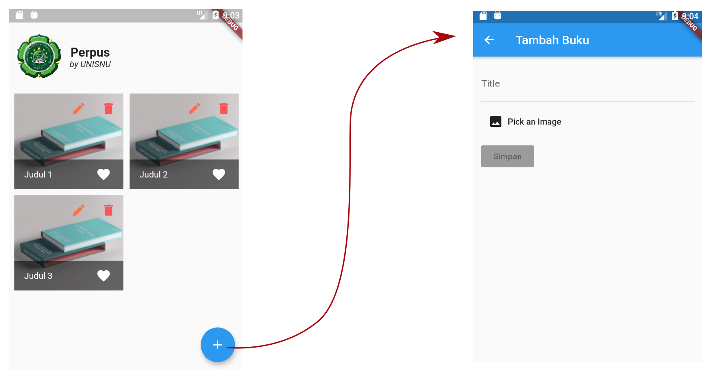

# (C)reate

Meskipun tidak harus selalu memulai dengan (C)reate sesuai urutan dari singkatan CRUD. Dan sepertinya tidak begitu banyak yang menekankan harus (C)reate dahulu, kali ini kita mulai saja sesuai dengan urutan yaitu (C)reate.

## Mulai dari "Provider"

Untuk fungsi CRUD, termasuk (C)reate, akan bertempat di **provider**. Untuk itu, mari kita buka file `lib/providers/booklist_provider.dart`. Ubah/tambah sesuai dengan baris yang ter-*highlight* berikut:

```dart linenums="1" hl_lines="2-7 10 13-62"
import 'package:flutter/material.dart';
import 'dart:convert';
import 'package:path/path.dart' as path;
import 'package:http_parser/http_parser.dart';
import 'package:http/http.dart' as http;
import 'package:mime/mime.dart';
import 'package:provider/provider.dart';

import 'package:perpus/models/booklist_model.dart';
import 'package:perpus/providers/setting_provider.dart';

class BookListProvider with ChangeNotifier {
  bool _isCreating = false;

  bool get isCreating {
    return this._isCreating;
  }

  Future<Map<String, dynamic>> create(
      BuildContext context, BookListModel data) async {
    this._isCreating = true;
    notifyListeners();
    final settingData = Provider.of<SettingProvider>(context, listen: false);
    if (data == null || data.title == "") {
      Map<String, dynamic> resInvalid = new Map<String, dynamic>();
      resInvalid["statusCode"] = 400;
      resInvalid["message"] = "Input is not valid";
      this._isCreating = false;
      notifyListeners();
      return resInvalid;
    }

    List mimeStr = lookupMimeType(data.imageFile.path).split("/");

    var imageBytes = await data.imageFile.readAsBytes();
    var uri = Uri.parse(
        '${settingData.setting.apiHost}/perpus-api/booklist/${settingData.setting.userName}');
    var request = http.MultipartRequest('POST', uri)
      ..fields['title'] = data.title
      ..files.add(http.MultipartFile.fromBytes('image', imageBytes,
          filename: path.basename(data.imageFile.path),
          contentType: MediaType(mimeStr[0], mimeStr[1])));
    int statusCode;
    try {
      http.StreamedResponse res = await request.send();
      statusCode = res.statusCode;
      final String respStr = await res.stream.bytesToString();
      Map<String, dynamic> resDecoded = json.decode(respStr);
      resDecoded["statusCode"] = res.statusCode;
      this._isCreating = false;
      notifyListeners();
      return resDecoded;
    } catch (e) {
      Map<String, dynamic> resInvalid = new Map<String, dynamic>();
      resInvalid["statusCode"] = statusCode != null ? statusCode : 400;
      resInvalid["message"] = e.toString();
      this._isCreating = false;
      notifyListeners();
      return resInvalid;
    }
  }

  // _list ini adalah model utama dari daftar buku kita
  // akan digunakan untuk menampilkan daftar buku
  // yang didapat dari REST API
  List<BookListModel> _list = [
...
```

## *UI* ( User interface )

UI untuk (C)reate adalah sebuah **screen** terpisah, yang bisa dibuka dari halaman "home". Berikut ini flow UI nya:



1. Trigger
    *trigger* atau pemicu adalah sebuah tombol dari halaman "home". Buka file `lib/screens/home-page.dart`, lihat pada code yang ter-*highlight* dibawah, code tersebut adalah pemicu UI untuk input buku:

    ```dart linenums="5" hl_lines="5-9"
    ...
    class MyHomePage extends StatelessWidget {
      MyHomePage({Key key}) : super(key: key);
    
      _newBook(BuildContext addButtonContext) async {
        Navigator.of(addButtonContext).pushNamed(
          BookInputScreen.routeName,
        );
      }
    
      @override
      Widget build(BuildContext context) {
        return Scaffold(
    ...
    ```

1. Input "screen"
    Input "screen" bisa dilihat di `lib/screens/book-input.dart`. Fungsi dasar untuk input judul dan gambar sudah tersedia. Kita tinggal cukup "menjahit" saja dengan REST API untuk (C)reate. Sebenarnya, selain (C)reate, UI ini juga digunakan untuk (U)pdate
   
## "Jahit" (C)reate REST API

Akhirnya... :tada:, setelah begitu banyak yang kita lakukan. Saat nya kita mencoba satu bagian dari CRUD yaitu (C)reate.

Masih di `lib/screens/book-input.dart`, ubah/tambah sesuai dengan baris yang ter-*highlight* berikut ini:

```dart linenums="1" hl_lines="4-7 54-85 88 134-138 141-148"
import 'package:flutter/material.dart';
import 'dart:io';
import 'package:image_picker/image_picker.dart';
import 'package:provider/provider.dart';

import 'package:perpus/models/booklist_model.dart';
import 'package:perpus/providers/booklist_provider.dart';

class BookInputScreenArguments {
  final String id;
  final String title;
  final String imagePath;
  BookInputScreenArguments({this.id, this.title, this.imagePath});
}

class BookInputScreen extends StatefulWidget {
  static const routeName = "/book-add";

  @override
  _BookInputScreenState createState() => _BookInputScreenState();
}

class _BookInputScreenState extends State<BookInputScreen> {
  String _title;
  bool _inputIsValid = false;
  BookInputScreenArguments _args;

  File _image;
  final picker = ImagePicker();

  Future _pickImage() async {
    final pickedFile = await picker.getImage(source: ImageSource.gallery);

    setState(() {
      if (pickedFile != null) {
        _image = File(pickedFile.path);

        this._setInputValid();
      } else {
        print('No image selected.');
      }
    });
  }

  void _setInputValid() {
    this._inputIsValid =
        this._title != null && this._title != "" && this._image != null;
  }

  bool get inputIsValid {
    return this._inputIsValid;
  }

  Future<void> _submit(BuildContext submitContext) async {
    this._create(submitContext);
  }

  Future<void> _create(BuildContext submitContext) async {
    final BookListModel inputData = new BookListModel(
      id: null,
      title: this._title,
      imagePath: null,
      imageFile: this._image,
    );
    final BookListProvider booklistData =
        Provider.of<BookListProvider>(submitContext, listen: false);
    Map<String, dynamic> submitRes =
        await booklistData.create(submitContext, inputData);

    if (submitRes["statusCode"] != null && submitRes["statusCode"] == 200) {
      Navigator.pop(context, submitRes["statusCode"]);
    } else {
      Scaffold.of(submitContext)
        ..removeCurrentSnackBar()
        ..showSnackBar(
          SnackBar(
            content: Text(
                "Error \n- Status: ${submitRes["statusCode"]} \n- Message: ${submitRes["message"]}"),
            duration: Duration(seconds: 5),
            backgroundColor: Colors.redAccent.shade400,
          ),
        );
    }
  }

  @override
  Widget build(BuildContext context) {
    bool isCreating = context.watch<BookListProvider>().isCreating;
    return Scaffold(
      appBar: AppBar(
        title: this._args == null || this._args.id == null
            ? const Text("Tambah Buku")
            : const Text("Edit Buku"),
      ),
      body: Padding(
        padding: const EdgeInsets.all(15.0),
        child: Form(
          child: SingleChildScrollView(
            child: Column(
              crossAxisAlignment: CrossAxisAlignment.start,
              children: <Widget>[
                TextFormField(
                  decoration: InputDecoration(labelText: 'Title'),
                  initialValue: this._title,
                  onChanged: (v) {
                    setState(() {
                      this._title = v;
                      this._setInputValid();
                    });
                  },
                ),
                SizedBox(height: 10),
                FlatButton.icon(
                  icon: Icon(Icons.image),
                  onPressed: _pickImage,
                  label: Text("Pick an Image"),
                ),
                ClipRRect(
                  borderRadius: BorderRadius.circular(8.0),
                  child: this._image == null
                      ? Container()
                      : Image(
                          image: FileImage(this._image),
                          width: 230,
                          height: 150,
                          fit: BoxFit.cover,
                        ),
                ),
                SizedBox(height: 10),
                Builder(builder: (BuildContext submitContext) {
                  return RaisedButton(
                    child: Text("Simpan"),
                    color: Colors.lightBlueAccent,
                    onPressed: !this.inputIsValid || isCreating
                        ? null
                        : () {
                            this._submit(submitContext);
                          },
                  );
                }),
                isCreating == false
                    ? Container()
                    : Center(
                        child: Padding(
                          padding: const EdgeInsets.only(top: 50),
                          child: CircularProgressIndicator(),
                        ),
                      )
              ],
            ),
          ),
        ),
      ),
    );
  }
}
```

1. Baris 54-56, disini, selain (C)reate, nanti akan dilakukan juga (U)pdate
1. Baris 58-84, adalah block dari *logic* (C)reate
1. Baris 88, adalah mengambil **state** dari **provider** untuk kondisi `isCreating`, dimana jika bernilai `true`, berarti sedang melakukan (C)reate ke server HTTP kita. Sebaliknya, jika bernilai `false`, berarti proses (C)reate sudah selesai
1. Baris 134-138, Tombol akan di disable ( dengan `null` handler), jika:
    1. Input tidak valid
    1. `isCreating = true`, yang berarti sedang ada proses (C)reate ke server HTTP
1. Baris 141-148, Akan menampilkan "loading indicator" saat terjadi proses (C)rud. yaitu icon yang berputar-putar, agar user tahu bahwa masih ada proses menyimpan ke server

## Test input

1. Coba input data judul dan gambar
1. Click simpan
1. Check https://perpus-api.biqdev.com/perpus-api/booklist/**&lt;nama_user&gt;**

untuk **&lt;nama_user&gt;** diatas adalah sesuai setting yang kita masukkan pada step **[SettingProvider](provider-setup.md#settingprovider)**

Jika anda melihat tampilan kurang lebih seperti ini:

```json5
{
    "status": "success",
    "message": "",
    "data": [
        {
        "id": "5fd392d65a98d61f7dc045de",
        "title": "Judul 10",
        "image_path": "assets/biqdev/1607701206244514318-image_picker274694392.jpg"
        }
    ]
}
```

Selamat :tada:, anda berhasil.
