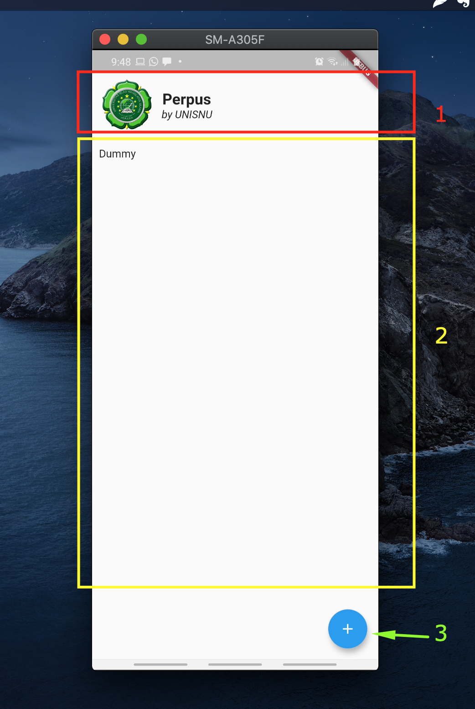
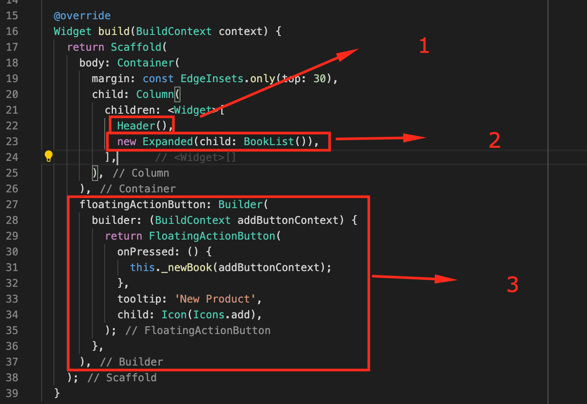

# Overview
Rencana pengembangan aplikasi

## Layout

Berikut ini layout aplikasi android yang akan kita buat. Pada

### A. Layout halaman utama ( Home )

Halaman utama / home terdiri dari 3 widget seperti pada screenshot berikut.

{: style="height:auto;width:300px"}

Layout tersebut dibentuk pada code: `lib/screens/home-page.dart`

#### 1. Header
Komponen header pada screenshot diatas adalah sebuah "custom widget" yang di definisikan pada file : `lib/widgets/home/header.dart`

#### 2. Grid view
Pada bagian grid view ini nanti akan tampil daftar buku. Bagian ini juga dibuat dengan custom widget yang didefinisikan pada file: `lib/widgets/home/book-list.dart`

#### 3. Floating button
Bagian terakhir ini ada tombol yang akan menampilkan "screen" baru, yaitu screen "input".

## REST API
Interface CRUD yang akan kita gunakan adalah REST API.

Struktur URL REST API kita adalah sebagai berikut:

`<host>/perpus-api/booklist/<user_name>`

1. **`<host>`** adalah alamat dimana REST API kita di host. Misal http://127.0.0.1, http://localhost atau https://www.biqdev.com
2. **`<user_name>`** setiap user akan memiliki tampilan sendiri sesuai dengan user name yang dipilih.
