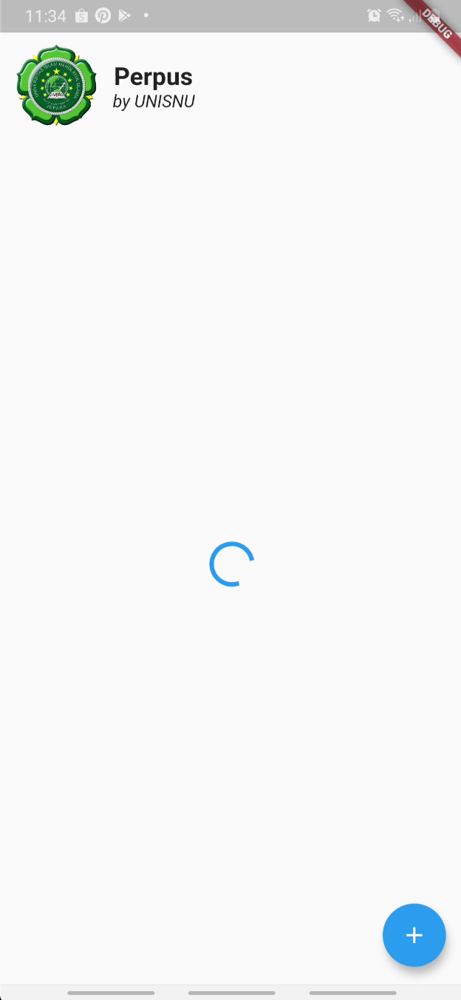

# (R)ead

Pada bagian (R)ead ini, kita akan membaca data dari REST API dengan response yang berformat JSON. Berdasarkan standard [https://tools.ietf.org/html/rfc2616#section-9.3](https://tools.ietf.org/html/rfc2616#section-9.3), kita menggunakan **GET** sebagai "HTTP verb" untuk melakukan prosedur (R)ead ini.

## Hapus data mockup

Langkah pertama, kita harus menghapus data-data mockup yang telah kita buat. Perhatikan dan **hapus** baris yang ter-*highlight* berikut:

```dart linenums="62" hl_lines="6-22"
...
  // _list ini adalah model utama dari daftar buku kita
  // akan digunakan untuk menampilkan daftar buku
  // yang didapat dari REST API
  List<BookListModel> _list = [
    // Kita buat dummy data atau data palsu
    // hanya untuk tujuan mockup dulu
    BookListModel(
      id: "1",
      title: "Judul 1",
      imagePath: "assets/book.png",
    ),
    BookListModel(
      id: "2",
      title: "Judul 2",
      imagePath: "assets/book.png",
    ),
    BookListModel(
      id: "3",
      title: "Judul 3",
      imagePath: "assets/book.png",
    ),
  ];
...
```

Sehingga menjadi:

```dart linenums="62" hl_lines="5"
...
  // _list ini adalah model utama dari daftar buku kita
  // akan digunakan untuk menampilkan daftar buku
  // yang didapat dari REST API
  List<BookListModel> _list = [];
...
```

## Fungsi (R)ead di provider

Seperti pada (C)reate, kita juga menggunakan **provider** untuk meletakkan fungsi (R)ead sesungguhnya yang terhubung langsung ke REST API.

Untuk itu, buka kembali file `lib/providers/booklist_provider.dart`, kemudian perhatikan dan ubah/tambah code sesuai pada bagian yang ter-*highlight* berikut:

```dart linenums="82" hl_lines="12-55"
...
    } catch (e) {
      // Jika terjadi error
      Map<String, dynamic> resInvalid = new Map<String, dynamic>();
      resInvalid["statusCode"] = statusCode != null ? statusCode : 400;
      resInvalid["message"] = e.toString();
      this._isCreating = false;
      notifyListeners(); //Prosedur standard untuk memberitahu "listener" bahwa ada perubahan
      return resInvalid;
    }
  }

  // _isReading Digunakan untuk menampilkan "loading indicator"
  // Dan juga logic lain yang membutuhkannya
  bool _isReading = false;
  // Getter dari _isReading
  bool get isReading {
    return this._isReading;
  }

  Future<void> read(BuildContext context) async {
    // Tandai "true" agar aplikasi tahu sedang terjadi proses (R)ead
    this._isReading = true;
    final settingData = Provider.of<SettingProvider>(context, listen: false);
    // Susun URL dengan menggunakan variable dari "setting provider" ditambah pattern API kita
    String url =
        "${settingData.setting.apiHost}/perpus-api/booklist/${settingData.setting.userName}";

    // res adalah variable untuk menampung Response dari server
    http.Response res;

    // ada kemungkinan error saat http.get(), jadi gunakan block "try"
    try {
      final resTmp = await http.get(url);
      res = resTmp;
    } catch (e) {
      this._isReading = false;
      throw (e);
    }
    List<BookListModel> bookListData = (json.decode(res.body)["data"]
            as List) // Decode response sebagai "List"
        .map((i) => BookListModel.fromJson(
            i)) // Format "List" agar sesuai dengan BookListModel
        .toList(); // Terakhir, convert agar jadi "List of BookListModel" ( List<BookListModel> )

    // Menyimpan state ke variable _list,
    // ini variable yg akan dibaca oleh component yang membutuhkan daftar buku
    this._list = bookListData;

    // Kembalikan _isReading ke false yang berarti proses (R)ead selesai
    this._isReading = false;

    // notifyListeners() Memberitahukan kepada semua listener bahwa ada perubahan di provider ini
    notifyListeners();
  }
}
```

## "Jahit" API Request ke Grid

Saat nya "menjahit" API Request kit Grid view yang telah kita buat. Jika sebelumnya kita menggunakan data "mockup", kali ini kita akan benar-benar mengambil dari REST API Server.

### Panggil `read()` dari `BookListProvider`
Buka file `lib/widgets/home/book-list.dart`. Pada file ini, kita hanya akan memicu fungsi `read()` yang telah kita buat pada `BookListProvider` yang baru saja kita tambahkan. Dengan memanggil fungsi `read()` tersebut, aplikasi kita akan mem-*fetch* data dari REST API. Sehingga setelah proses selesai, component "Grid view" kita akan tahu ada perubahan data dan me-*render* nya.

Perhatikan dan ubah/tambah sesuai code yang ter-*highlight* berikut:

```dart linenums="13" hl_lines="3-17"
...
class _BookListState extends State<BookList> {
  // _isInitialized adalah helper variable
  // berguna untuk mencegah "pemanggilan berulang"
  // digunakan pada fungsi "if" dibawah
  // karena didChangeDependencies() pada komponen akan dipanggil lebih dari 1 kali
  bool _isInitialized;
  @override
  void didChangeDependencies() {
    // If dibawah ini mencegah pemanggilan ganda dari blok didalamnya
    if (this._isInitialized == null || !this._isInitialized) {
      context.read<BookListProvider>().read(context);
      this._isInitialized = true;
    }
    // Memanggil "parent" didChangeDependencies(), harus selalu dilakukan
    super.didChangeDependencies();
  }

  @override
  Widget build(BuildContext context) {
...
```

Jalankan ulang aplikasi, tunggu beberapa saat. Jika semua sudah benar, seharusnya saat ini kita akan melihat aplikasi android kita sudah menggunakan data dari server yang sudah kita input sebelumnya.

### Tampilkan "loading indicator"

Mengunggu tanpa kepastian akan membuat tidak nyaman, bahkan bisa membuat hayati lelah :smile:. Karena itu mari mari kita atur *UX* agar membuat user merasa nyaman dengan *behavior* dari aplikasi kita. *UX* adalah singkatan dari *User experience*, yang berkaitan erat dengan *UI* ( *User interface* ) pada bidang frontend development.

Masih pada file `lib/widgets/home/book-list.dart`, perhatikan dan ubah/tambah sesuai code yang ter-*highlight* dibawah ini:

```dart linenums="30" hl_lines="7-17"
...
  @override
  Widget build(BuildContext context) {
    var apiHost =
        Provider.of<SettingProvider>(context, listen: false).setting.apiHost;
    List<BookListModel> bookList = context.watch<BookListProvider>().list;

    bool isReading = context.watch<BookListProvider>().isReading;

    return isReading == null || isReading
        ? Column(
            mainAxisAlignment: MainAxisAlignment.center,
            children: <Widget>[
              CircularProgressIndicator(),
            ],
          )
        : GridView.builder(
            padding: EdgeInsets.all(10),
            itemCount: bookList.length,
            itemBuilder: (ctx, i) => BookListItem(
              id: bookList[i].id,
              apiHost: apiHost,
              imagePath: bookList[i].imagePath,
              title: bookList[i].title,
            ),
            gridDelegate: SliverGridDelegateWithFixedCrossAxisCount(
              crossAxisCount: 2,
              childAspectRatio: 8 / 7,
              crossAxisSpacing: 10,
              mainAxisSpacing: 10,
            ),
          );
```

Simpan dan jalankan dengan tombol restart {: style="height:25px; width:auto;"}. Seharusnya kita melihat tampilan "loading indicator" seperti dibawah ini:

{: style="width: 250px; height: auto;"}
